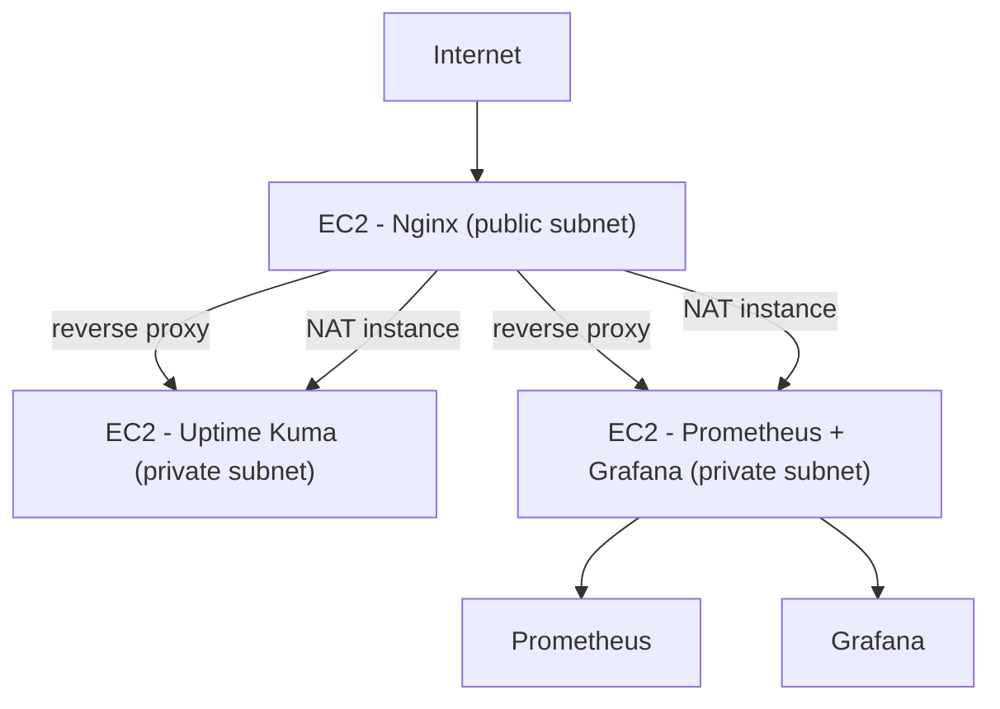
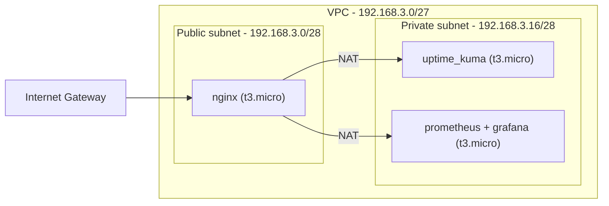

# fern_ops


AWS infrastructure provisioned with Terraform and configured with Ansible. Deploys a full observability stack - Prometheus, Grafana, Uptime Kuma - behind an Nginx reverse proxy, all running in Docker containers on private EC2 instances.

---

## Overview



### Network layout



### Project structure

```
fern_ops/
├── terraform/
│   ├── providers.tf        - AWS provider (eu-west-3)
│   ├── network.tf          - VPC, subnets, IGW, route tables
│   ├── security.tf         - Security groups (public / private)
│   ├── ec2.tf              - 3 EC2 instances (nginx, uptime_kuma, prometheus+grafana)
│   ├── outputs.tf
│   ├── variables.tf
│   └── terraform.tfvars    - gitignored
└── ansible/
    ├── ansible.cfg
    ├── inventory/
    │   └── hosts.ini.example
    └── playbooks/
        └── site.yml
    └── roles/
        ├── base/            - Docker, unattended-upgrades, system config
        ├── uptime_kuma/
        ├── prometheus/
        ├── grafana/
        └── nginx/           - Reverse proxy + Let's Encrypt
```

---

## Usage

### Prerequisites

- Terraform >= 1.0
- Ansible >= 2.12
- AWS CLI configured (`~/.aws/credentials`)
- SSH key registered in AWS
- `curl -s ifconfig.me` for our public IP

### 1. Provision the infrastructure

```bash
cd terraform
terraform init
terraform fmt
terraform validate
terraform plan
terraform apply
```

### 2. Configure and deploy services

```bash
cd ansible

# Dry run
ansible-playbook -i inventory/hosts.ini playbooks/site.yml --check

# Deploy
ansible-playbook -i inventory/hosts.ini playbooks/site.yml
```

---

## Specificities

### Infrastructure

| Resource | Details |
|---|---|
| VPC | 192.168.3.0/27 - eu-west-3a |
| Public subnet | 192.168.3.0/28 - nginx EC2 |
| Private subnet | 192.168.3.16/28 - app EC2s |
| Internet Gateway | Public internet access |
| NAT | nginx EC2 acts as NAT instance (source_dest_check = false) |
| EC2 AMI | Ubuntu 24.04 LTS (t3.micro) |

### Ansible roles

| Role | Responsibility |
|---|---|
| `base` | Docker install, unattended-upgrades, system base config - always runs first |
| `uptime_kuma` | Uptime monitoring in Docker |
| `prometheus` | Metrics collection in Docker |
| `grafana` | Metrics visualization in Docker |
| `nginx` | Reverse proxy + Let's Encrypt TLS termination |

### Security

- **No NAT Gateway** - the nginx EC2 acts as a NAT instance to route private subnet outbound traffic, keeping costs low
- **Private subnet** - Uptime Kuma and Prometheus + Grafana are not directly reachable from the internet
- **No credentials in code** - AWS access via CLI profile, sensitive values in `terraform.tfvars` (gitignored)
- **Ansible Vault** - for secrets passed to Ansible roles
- **HTTPS** - Let's Encrypt certificate managed by the nginx role

### Stack

| Layer | Technology |
|---|---|
| Provisioning | Terraform (AWS provider) |
| Configuration | Ansible |
| Monitoring | Prometheus + Grafana |
| Uptime | Uptime Kuma |
| Reverse proxy | Nginx + Let's Encrypt |
| Runtime | Docker (all services containerized) |
| OS | Ubuntu 24.04 LTS |
| Hosting | AWS EC2 t3.micro (eu-west-3) |

---

## License

MIT
